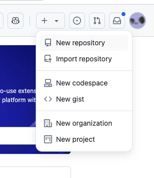
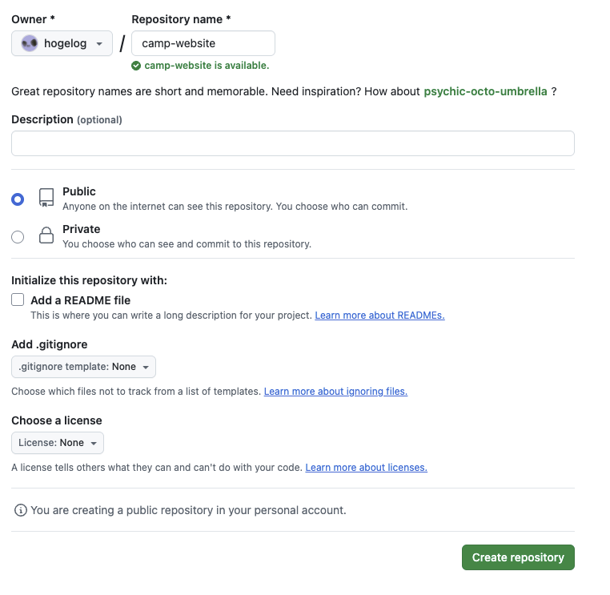
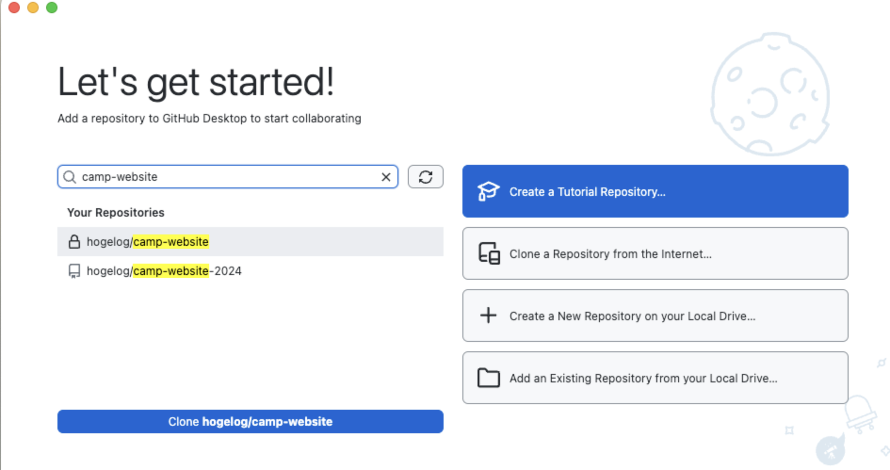
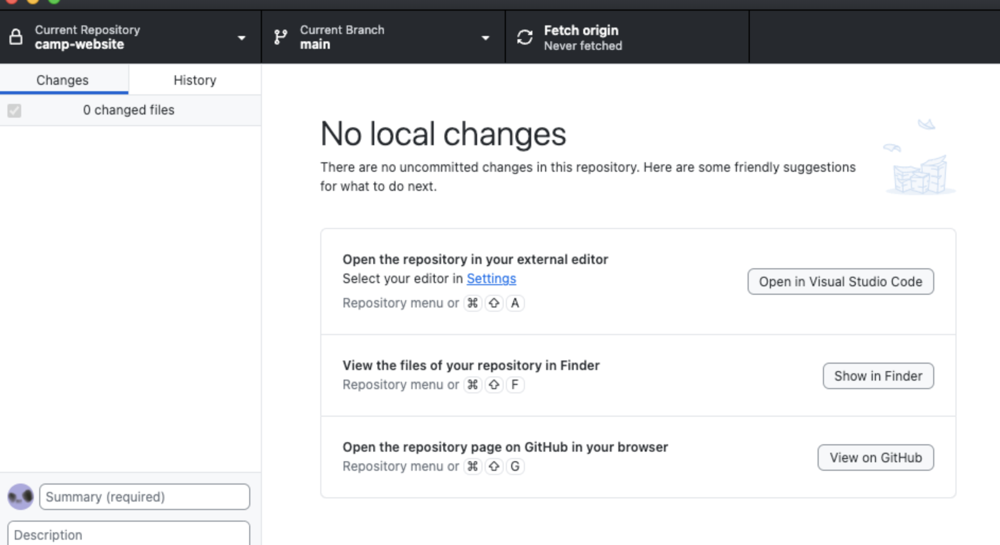
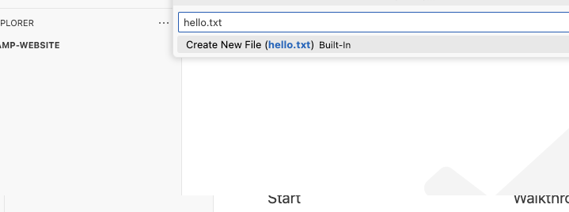
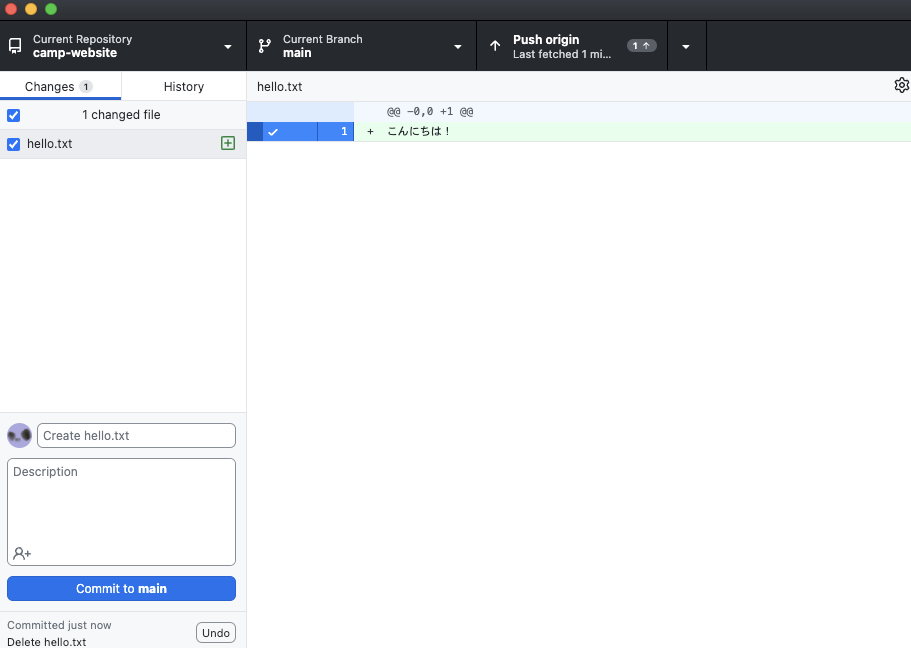
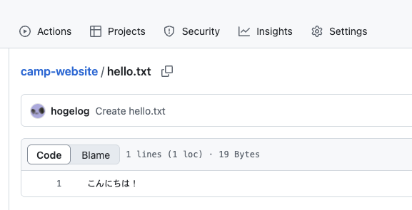

# セットアップ

この章では、プログラミングをするための環境をセットアップしていきます。

## GitHubを使ってみる
GitHubはプログラムのソースコードを管理するためのサービスです。
非常に人気のあるサービスで、多くのウェブ開発者が利用しています。

### GitHubアカウントを作成してみる
GitHub <https://github.com/> にアカウントを作ってみましょう。

ここで作成したアカウントのユーザ以下に、あなたが作成したプログラムを保存していくことになります。

例: <https://github.com/hogelog>

まずは「New repository」リンクから camp-website のような名前のリポジトリを作成してみましょう。

作成したリポジトリは最初は空っぽです。
作成したプログラムはこのリポジトリに保存していきます。

## GitHub Desktopをインストールする
GitHub DesktopはGitHubのリポジトリを簡単に管理できるアプリケーションです。
以下のリンクからダウンロードしてインストールしましょう。

<https://desktop.github.com/>

インストールが完了したら、先ほど作成したGitHubアカウントでサインインします。

### リポジトリをクローンする
GitHub Desktopを起動したら、先ほど作成したリポジトリをクローンします。

クローンとは、GitHubのリポジトリを自分のコンピュータにコピーすることです。

これでGitHubリポジトリを手元にコピーしてくることができました。

## Visual Studio Codeを使ってみる
プログラミングをするためのエディターとして、Visual Studio Code (VS Code) を使ってみましょう。
<https://code.visualstudio.com/>

世の中には様々なエディターがありますが、Visual Studio Codeは無料で使える非常に人気のあるエディターです。

### VS Codeでクローンしたリポジトリを開く
GitHub Desktopの「Open in Visual Studio Code」からVS Codeでリポジトリを開くことができます。

### VS Codeでテキストファイルを作成してみる
- クローンしたリポジトリ内に hello.txt というファイルを作成して、`Hello, World!` と書いて保存してみましょう  
  

### 変更をGitHubにプッシュする
ファイルを作成したら、その変更をGitHubに反映させましょう。

1. GitHub Desktopで変更されたファイルを確認します
2. 変更内容を説明する「コミットメッセージ」を入力します
3. 「Commit to main」ボタンをクリックしてコミットします
4. 「Push origin」ボタンをクリックして変更をGitHubに反映させます

これで hello.txt がGitHubリポジトリにプッシュされました。

GitHubのリポジトリページにアクセスすると、手元で作成した hello.txt の内容が反映されていることを確認できます。

ここまでで今日のプログラミングに使う道具の説明は終了です。
次の章からは実際に手を動かしてウェブサイトを作成してきましょう。

## Tips
- VS Codeの表示を日本語にするには以下の手順を参考にしてください
  - <https://code.visualstudio.com/docs/getstarted/locales>
- VS Codeのより発展的な使い方については以下のドキュメントを参考にしてください
  - <https://code.visualstudio.com/docs>
- GitHubのより発展的な使い方については以下のドキュメントを参考にしてください
  - <https://docs.github.com/ja/get-started>
- GitHub Desktopの詳しい使い方については以下のドキュメントを参考にしてください
  - <https://docs.github.com/ja/desktop>
