# セットアップ

この章では、プログラミングをするための環境をセットアップしていきます。

## Visual Studio Codeを使ってみる
プログラミングをするためのエディターとして、Visual Studio Code (VS Code) を使ってみましょう。
<https://code.visualstudio.com/>

世の中には様々なエディターがありますが、Visual Studio Codeは無料で使える非常に人気のあるエディターです。

### VS Codeでテキストファイルを作成してみる
- VS Codeで camp-website という名前のディレクトリを作成し、開いてみましょう  
  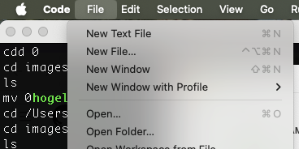
- 作成したディレクトリに hello.txt というファイルを作成して、`Hello, World!` と書いて保存してみましょう  
  

### Tips
- VS Codeの表示を日本語にするには以下の手順を参考にしてください
  - <https://code.visualstudio.com/docs/getstarted/locales>
- VS Codeのより発展的な使い方については以下のドキュメントを参考にしてください
  - <https://code.visualstudio.com/docs>

## GitHubを使ってみる
GitHubはプログラムのソースコードを管理するためのサービスです。
非常に人気のあるサービスで、多くのウェブ開発者が利用しています。

### GitHubアカウントを作成してみる
GitHub <https://github.com/> にアカウントを作ってみましょう。


ここで作成したアカウントのユーザ以下に、あなたが作成したプログラムを保存していくことになります。

例: <https://github.com/hogelog>

まずは「New repository」リンクから camp-website のような名前のリポジトリを作成してみましょう。


作成したリポジトリは最初は空っぽです。
作成したプログラムはこのリポジトリに保存していきます。

### GitHubリポジトリにファイルをプッシュしてみる

先ほど作成したディレクトリ camp-website 内にある hello.txt をGitHubに作成した camp-website リポジトリにプッシュしてみましょう。

#### SSH鍵の設定
まずは手元からGitHubリポジトリコードをプッシュするための認証情報を設定します。

まずはTerminalを開きます。

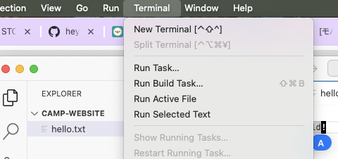

開いたターミナル内で以下のコマンドを実行しSSH鍵を作成します。

```
ssh-keygen -t ed25519 -C "your_email@example.com"
```

（`your_email@example.com` の部分はあなたのメールアドレスに置き換えてください）

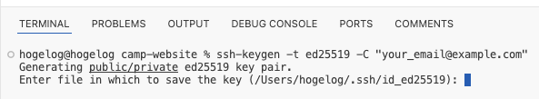

コマンドの結果で聞かれている通りに適当なパスフレーズを入力してください。

次に以下のコマンドを実行し、作成したSSH鍵の情報をmacOSのキーチェーンに登録します。

```
ssh-add --apple-use-keychain ~/.ssh/id_ed25519
```

ここで作成したSSH鍵の「公開鍵」をクリップボードにコピーします。

```
pbcopy < ~/.ssh/id_ed25519.pub
```

GitHubアカウントのSettings > SSH and GPG keysの画面 <https://github.com/settings/keys> の「New SSH key」ボタンから作成した鍵の「公開鍵」を登録してください。

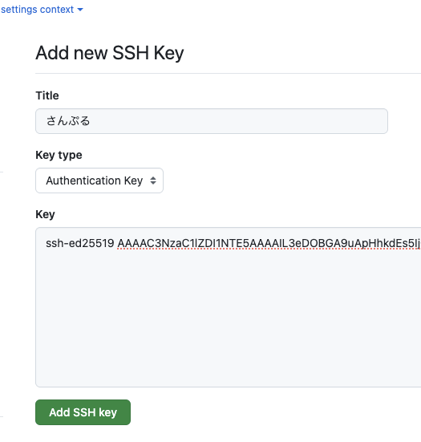


これで手元のGitリポジトリをGitHubにプッシュする準備が整いました。

#### Gitリポジトリのプッシュ
では手元のディレクトリ内のコードをGitHubリポジトリにプッシュしてみましょう。

まずは 手元のディレクトリ内でGitリポジトリを初期化します。

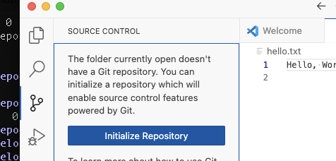

次に、 ローカルのGitリポジトリのプッシュ先としてGitHubのリポジトリを追加します。

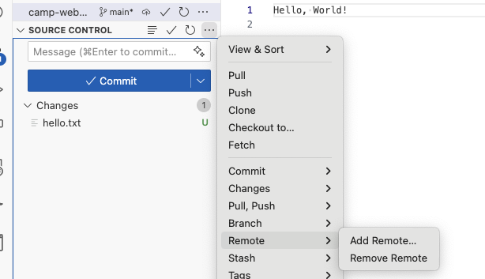

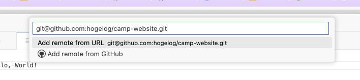

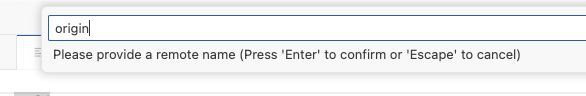

ここで設定するURLはGitHubリポジトリにある「SSH」URLです。
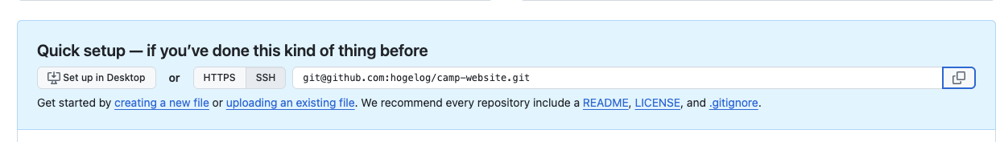

URLの次にリモートリポジトリの名前を設定しますが、ここでは origin という名前を使います。

（origin という名前ではなくても良いですが、一般的にメインで使うリモートリポジトリには origin という名前を使うことが多いです）

ここまで来たらあとは Commit & Push すると、先程作成したリポジトリに hello.txt がプッシュされます。

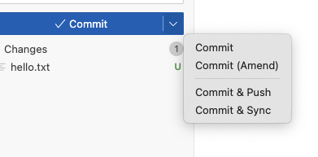

コミット時は毎回「この変更がなんなのか」を示す「コミットメッセージ」を書く必要があります。自分で後から見てもわかるようなメッセージを書きましょう。

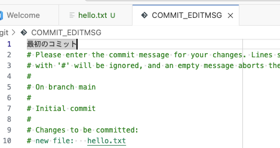

### Tips
- ここで説明したGitHubへのSSH鍵の登録については以下ドキュメントで詳細な手順が説明されています
  - <https://docs.github.com/ja/github/authenticating-to-github/connecting-to-github-with-ssh>
- GitHubのより発展的な使い方については以下のドキュメントを参考にしてください
  - <https://docs.github.com/ja/get-started>
