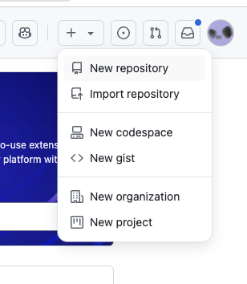
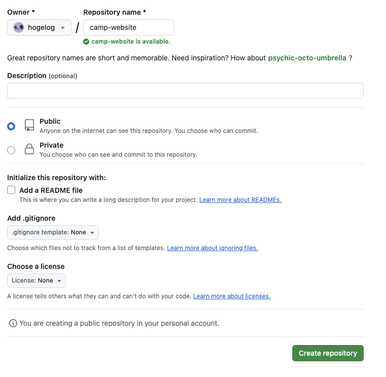
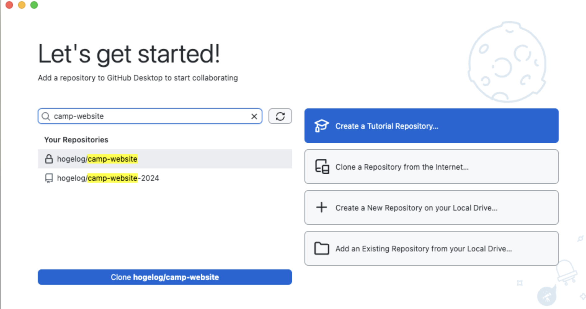
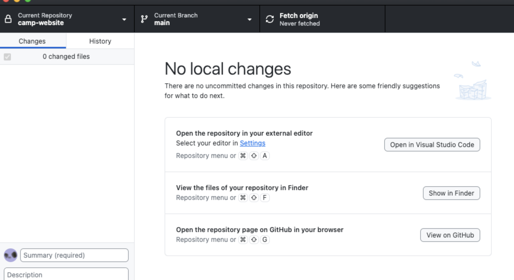
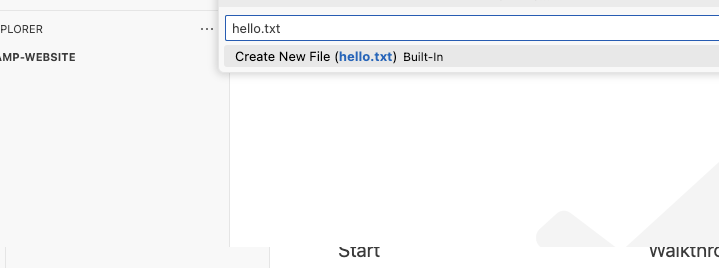
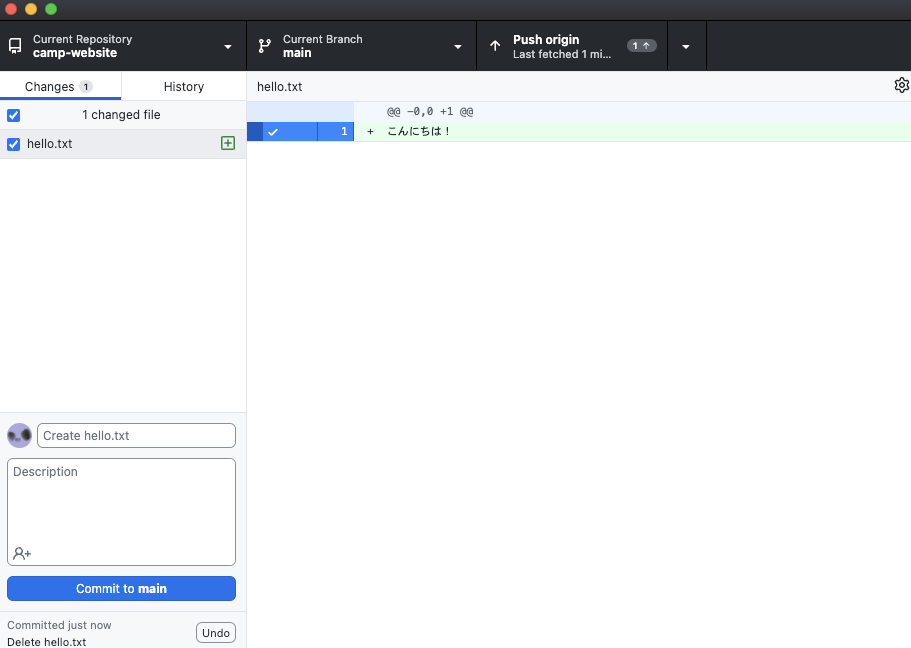
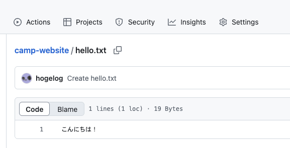

# セットアップ

この章では、プログラミングをするための環境をセットアップしていきます。

## GitHubを使ってみる
GitHubはプログラムのソースコードを管理するためのサービスです。
非常に人気のあるサービスで、多くのウェブ開発者が利用しています。

### GitHubアカウントを作成してみる
GitHub <https://github.com/> にアカウントを作ってみましょう。


ここで作成したアカウントのユーザ以下に、あなたが作成したプログラムを保存していくことになります。

例: <https://github.com/hogelog>

まずは「New repository」リンクから camp-website のような名前のリポジトリを作成してみましょう。





作成したリポジトリは最初は空っぽです。
作成したプログラムはこのリポジトリに保存していきます。

## GitHub Desktopをインストールする
GitHub DesktopはGitHubのリポジトリを簡単に管理できるアプリケーションです。
以下のリンクからダウンロードしてインストールしましょう。

<https://desktop.github.com/>

インストールが完了したら、先ほど作成したGitHubアカウントでサインインします。

### リポジトリをクローンする
GitHub Desktopを起動したら、先ほど作成したリポジトリをクローンします。



クローンとは、GitHubのリポジトリを自分のコンピュータにコピーすることです。



これでGitHubリポジトリを手元にコピーしてくることができました。

## Visual Studio Codeを使ってみる
プログラミングをするためのエディターとして、Visual Studio Code (VS Code) を使ってみましょう。
<https://code.visualstudio.com/>

世の中には様々なエディターがありますが、Visual Studio Codeは無料で使える非常に人気のあるエディターです。

### VS Codeでクローンしたリポジトリを開く
GitHub Desktopの「Open in Visual Studio Code」からVS Codeでリポジトリを開くことができます。

### VS Codeでテキストファイルを作成してみる
- クローンしたリポジトリ内に hello.txt というファイルを作成して、`Hello, World!` と書いて保存してみましょう  
  

### 変更をGitHubにプッシュする
ファイルを作成したら、その変更をGitHubに反映させましょう。

1. GitHub Desktopで変更されたファイルを確認します
2. 変更内容を説明する「コミットメッセージ」を入力します
3. 「Commit to main」ボタンをクリックしてコミットします
4. 「Push origin」ボタンをクリックして変更をGitHubに反映させます



これで hello.txt がGitHubリポジトリにプッシュされました。

GitHubのリポジトリページにアクセスすると、手元で作成した hello.txt の内容が反映されていることを確認できます。



## Claude Code をセットアップする
Claude Code はAIと対話しながらコードを書いたり読んだりできるツールです。
このキャンプでは、後半の章でClaude Codeを使ってウェブサイトに機能を追加したり、わからない箇所を質問したりします。

### Claude Code をインストールする
VS Codeの画面下部にあるターミナル (表示されていない場合はメニューから「ターミナル」→「新しいターミナル」) を開き、利用しているOSにあわせて以下のコマンドを実行します。

macOSの場合:

```sh
curl -fsSL https://claude.ai/install.sh | bash
```

Windowsの場合 (PowerShell):

```powershell
irm https://claude.ai/install.ps1 | iex
```

インストールが完了したらターミナルを一度閉じて開き直してください。

### Bedrock接続用スクリプトを受け取る
Claude Codeは裏側でAmazon BedrockというAWSのサービスを通してAIと通信します。キャンプ当日に、接続情報をあらかじめ埋め込んだ起動スクリプトをお渡しします。

- macOSを使う方: `workshop-claude.sh`
- Windowsを使う方: `workshop-claude.ps1`

このスクリプトには専用の接続トークンが埋め込まれています。誤ってGitHubに公開してしまわないよう、**クローンしたリポジトリの中ではなく、デスクトップ (Desktop) に保存してください**。

### Claude Code を起動してみる
VS Codeのターミナルで、クローンしたリポジトリのフォルダにいることを確認してから、利用しているOSに合わせて以下のコマンドを実行します (ターミナルのカレントフォルダはリポジトリのままで構いません)。

macOSの場合:

```sh
bash ~/Desktop/workshop-claude.sh
```

Windowsの場合 (PowerShell):

```powershell
& "$HOME\Desktop\workshop-claude.ps1"
```

起動したら「自己紹介して」と送ってみましょう。AIから返事が返ってくれば、セットアップは完了です。

終了するときは `/exit` と入力するか、`Ctrl+C` を2回押します。次にClaude Codeを使いたいときも、毎回このスクリプトから起動してください。

### スクリプトとトークンの取り扱いについて
- スクリプトに埋め込まれたトークンは、他の人と共有したり、GitHubなどインターネット上にアップロードしたりしないでください。
- トークンはキャンプ終了後に無効化されます。キャンプが終わったらデスクトップのスクリプトは削除して構いません。

ここまでで今日のプログラミングに使う道具の説明は終了です。
次の章からは実際に手を動かしてウェブサイトを作成してきましょう。

## Tips
- VS Codeの表示を日本語にするには以下の手順を参考にしてください
  - <https://code.visualstudio.com/docs/getstarted/locales>
- VS Codeのより発展的な使い方については以下のドキュメントを参考にしてください
  - <https://code.visualstudio.com/docs>
- GitHubのより発展的な使い方については以下のドキュメントを参考にしてください
  - <https://docs.github.com/ja/get-started>
- GitHub Desktopの詳しい使い方については以下のドキュメントを参考にしてください
  - <https://docs.github.com/ja/desktop>
- Claude Codeのより発展的な使い方については以下のドキュメントを参考にしてください
  - <https://code.claude.com/docs/en/quickstart>
