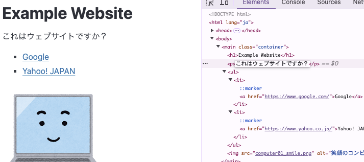
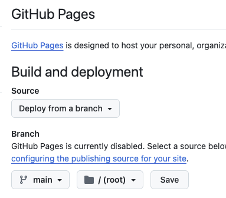

# HTML/CSSを書いてウェブサイトを作ってみる
この章ではHTMLとCSSを使って簡単なウェブサイトを作成し、ブラウザで表示してみます。

## HTMLを書いてみる

まず、以下のコードをVS Codeに入力またはコピー&ペーストしてみましょう。ファイル名は`index.html`とします。

```html
<!DOCTYPE html>
<html lang="ja">
<head>
  <title>Example Website</title>
</head>
<body>
これはウェブサイトです。
</body>
</html>
```

- これは最低限の要素だけが含まれたHTMLの基本的な構造です。
- HTMLはタグと呼ばれる `<foo>...</foo>` のような形式で記述されます。
- `<head> ... </head>` 内には「ウェブページのタイトル」のようなページ内には表示されないような情報を記述します。
  - `<title>` はウェブページのタイトルを指定します。ブラウザのタブやお気に入りに表示されます。
- `<body> ... </body>` には実際にウェブページブラウザに表示されるコンテンツを含むセクションです。

このHTMLをブラウザで開いてみると、`これはウェブサイトです。`と表示されるはずです。

また、VS Codeで index.html の文言を変更してブラウザでリロードし、変更が反映されることを確認してみましょう。

### 見出しやリンク、画像の追加

次に、ウェブページに見出しや段落、リンク、画像を追加してみましょう。

```html
<!DOCTYPE html>
<html lang="ja">
<head>
  <title>Example Website</title>
</head>
<body>

<h1>Example Website</h1>

<p>これはウェブサイトです。</p>

<ul>
  <li><a href="https://www.google.com/">Google</a></li>
  <li><a href="https://www.yahoo.co.jp/">Yahoo! JAPAN</a></li>
</ul>


</body>
</html>
```

- `<h1> ... </h1>` は大きな見出しを表示します。
- `<p>`: 段落を示すタグです。テキストを段落として表示します。
  - HTMLでは改行やスペースは無視されるため、段落を区切るためには`<p>`タグを使います。
- `<ul>`: 順序なしリスト（箇条書き）を作成します。
  - `<li>`: リストの各項目を示します。
- `<a href="URL">リンクテキスト</a>`: リンクを作成します。`href`属性でリンク先のURLを指定します。
- ``: 画像を表示します。`src`属性で画像ファイルのパスを指定し、`alt`属性で画像が表示できない場合の代替テキストを指定します。

computer01_smile.png 画像は以下のサイトからダウンロードして、index.html と同じディレクトリに保存してください。
https://www.irasutoya.com/2018/12/blog-post_939.html

このHTMLをブラウザで開いてみると、リストやリンク、画像などが表示されています。

ここではごく基本的なHTML要素のみ利用しましたが、HTMLにはたくさんの機能が存在します。発展的な内容については MDN のドキュメントなどを参照ください。

- MDN HTMLの基本 <https://developer.mozilla.org/ja/docs/Learn/Getting_started_with_the_web/HTML_basics>
- MDN HTMLの学習 <https://developer.mozilla.org/ja/docs/Learn/HTML>

## CSSを書いてみる

### 基本的なCSS
CSS (Cascading Style Sheets) を使うことで、ウェブページの見た目を更にカスタマイズできます。

ウェブページにスタイルを追加して、見た目を変更してみましょう。

```html
<!DOCTYPE html>
<html lang="ja">
<head>
  <title>Example Website</title>
  <style>
    h1 {
      color: grey;
    }
    a {
      font-weight: bold;
    }
  </style>
</head>
<body>

<h1>Example Website</h1>
<p>これはウェブサイトです。</p>

<ul>
  <li><a href="https://www.google.com/">Google</a></li>
  <li><a href="https://www.yahoo.co.jp/">Yahoo! JAPAN</a></li>
</ul>


</body>
</html>
```

- `<style>`: HTML内にCSSを記述するためのタグです。
- `h1 { color: grey; }`: `<h1>` タグのテキストカラーをグレーに設定します。
- `a { font-weight: bold; }`: `<a>` タグ内のテキストのフォントを太くなるよう設定します。

このHTMLをブラウザで開いてみると、見出しやリンクのスタイルが変更されていることが確認できます。

### 外部CSSを使ってみる
CSSは上述の通り、HTML内に記述することもできますが、別ファイルに記述してリンクすることもできます。

外部のCSS、Pico CSSを用いて見た目をきれいにしてみましょう。

```html
<!DOCTYPE html>
<html lang="ja">
<head>
  <title>Example Website</title>
  <link rel="stylesheet" href="https://cdn.jsdelivr.net/npm/@picocss/pico@2/css/pico.min.css" >
  <style>
  </style>
</head>
<body>
  <main class="container">
    <h1>Example Website</h1>
    <p>これはウェブサイトです。</p>
    
    <ul>
      <li><a href="https://www.google.com/">Google</a></li>
      <li><a href="https://www.yahoo.co.jp/">Yahoo! JAPAN</a></li>
    </ul>
    
    
  </main>
</body>
</html>
```

- `<link rel="stylesheet" href="https://cdn.jsdelivr.net/npm/@picocss/pico@2/css/pico.min.css" >` ではPico CSSを読み込んで、Pico CSSのスタイルをウェブページに適用しています。
- `<body>` 内のコンテンツを全て `<main class="container">...</main>` で囲っています。これはPico CSSのスタイルを適用するためのコンテナです。

このHTMLをブラウザで開いてみると、Pico CSSのスタイルが適用されたウェブページが表示されます。
表示されているコンテンツは同一なまま、見た目が整っている様子が確認できるはずです。

## 開発者コンソールを使ってみる

ブラウザの開発者コンソールを使うことで、ウェブページの構造やスタイルを確認・編集できます。

ウェブページ上で右クリックし、「検証」を選択して開発者コンソールを開き、リアルタイムでHTMLやCSSを編集し、変更を確認してみましょう。




## ウェブページとして公開してみる

ここまでで作成したウェブサイトを、GitHub Pagesを使って公開してみましょう。

GitHubリポジトリの「Settings > Pages」リンクからPagesの設定をおこなうことで、GitHub Pagesでウェブサイトを公開することができます。



GitHub Pagesで公開されたウェブサイトは、以下のようなURLでアクセスできます。

<https://hogelog.github.io/camp-website/>
