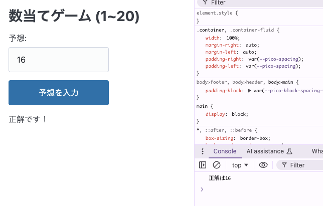

# JavaScriptを使ってもっと動くウェブサイトにしてみる

この章ではウェブサイトにJavaScriptを追加して、動的なコンテンツを作成してみます。

## 数当てゲームをサイトに組み込んでみる

以下のコードを`guessgame.html` として作成し、数当てゲームを実装してみましょう。

```html
<!DOCTYPE html>
<html lang="ja">
<head>
  <title>数当てゲーム</title>
  <link rel="stylesheet" href="https://cdn.jsdelivr.net/npm/@picocss/pico@2/css/pico.min.css" >
  <style>
    #guessGame {
      margin: 20px;
    }

    #guessGame input {
      width: 200px;
    }
  </style>
</head>
<body>

<main class="container">
  <h1>数当てゲーム (1~20)</h1>
  
  <div id="guessGame">
    <label for="guessField">予想: </label>
    <input type="number" min="1" max="20" id="guessField">
    <input type="submit" value="予想を入力" id="guessSubmit">
    <p id="guessResult"></p>
  </div>
</main>

<script>
  // 1から20までのランダムな整数を生成し、コンソールにログを出力
  let randomNumber = Math.floor(Math.random() * 20) + 1;
  console.log('正解は' + randomNumber);

  // HTML要素を取得
  let guessField = document.querySelector('#guessField');
  let guessSubmit = document.querySelector('#guessSubmit');
  let guessResult = document.querySelector('#guessResult');

  // ユーザーの入力をチェックし、結果を表示
  function checkGuess() {
    let userGuess = Number(guessField.value);
    if (userGuess === randomNumber) {
      guessResult.textContent = '正解です！';
    } else if (userGuess < randomNumber) {
      guessResult.textContent = 'もっと大きいです';
    } else if (userGuess > randomNumber) {
      guessResult.textContent = 'もっと小さいです';
    }
  }

  // submitがクリックされたときに、checkGuess関数を呼び出す
  guessSubmit.addEventListener('click', checkGuess);
</script>

</body>
</html>
```



HTMLの要素としては以下のようなものが追加されています。

- `<script> ... </script>` の部分にJavaScriptのコードを記述します。
- `<div id="guessGame"> ... </div>` 内に書かれたHTMLが数当てゲームの要素です。
- `id="guessGame"` の部分ではこの div 要素に guessGame というIDを割り振っています。
  - HTMLの要素に振ったIDはCSSやJavaScriptで指定する際に使います。
- `<input type="number">` は数値を入力するためのフィールドです。
- `<input type="submit">` は入力を投稿するボタンを表します。
- `<p id="guessResult"></p>` は何も表示しませんが、JavaScriptでゲームの結果を表示するための要素として用意しています。
- `<style>` タグの中でIDを使って対象を指定してスタイルを設定しています。`id="guessGame"` の要素に対するスタイルシートは `#guessGame { ... }` のように記述します。
- `<script>` タグ内にはJavaScriptのコードが記述されています。

このHTMLを開いてみて、数当てゲームをプレイしてみましょう。

正常に動作することが確認できたら guessgame.html もコミットしてGitHubにプッシュし、GitHub Pagesで公開しましょう。

<https://hogelog.github.io/camp-website/guessgame.html> のようなURLで公開され、正常に動作することを確認してみてください。


### Tips
- 開発者ツールはJavaScriptの開発にも便利です。JavaScriptの `console.log(...)` で出力した内容は、ブラウザの開発者ツールのコンソールに表示されます。
- JavaScriptについての詳細な情報は MDNのJavaScript入門 <https://developer.mozilla.org/ja/docs/Learn/Getting_started_with_the_web/JavaScript_basics> を参照してください。

## 発展課題

時間に余裕がある方は、以下の機能を追加してみてください。

- **範囲の変更**: 1~100 の範囲の数当てゲームに変えてみましょう。
- **試行回数の制限**: ユーザーが予想できる回数を制限し、ゲームオーバーの機能を追加してみましょう。
- **リセットボタンの実装**: ゲームを再度プレイできるように、リセットボタンを追加してみてください。
