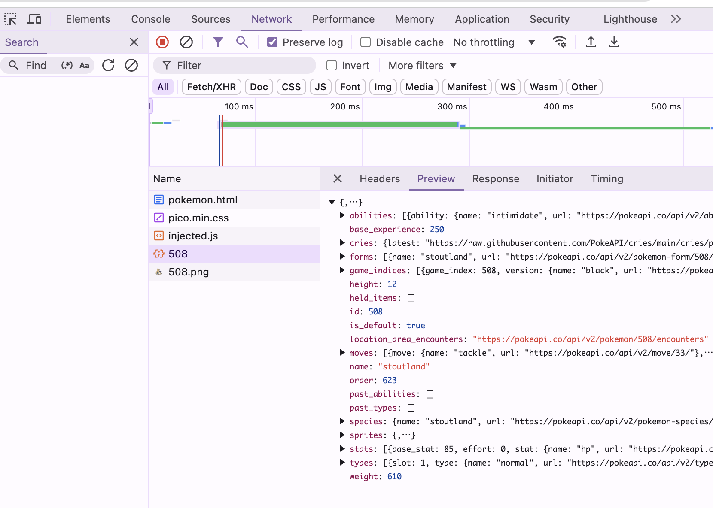

# Web APIを使って豪華なウェブサイトに

この章ではインターネット上で無料で公開されているWeb APIを使ってみます。

## PokéAPIを使って今日のラッキーポケモンを表示

以下のコードを使用して、PokéAPI <https://pokeapi.co/> からデータを取得し、ランダムなポケモンを表示してみましょう。

```html
<!DOCTYPE html>
<html lang="ja">
<head>
  <title>今日のポケモン</title>
  <link rel="stylesheet" href="https://cdn.jsdelivr.net/npm/@picocss/pico@2/css/pico.min.css" >
  <style>
    #pokemon {
      width: 300px;
    }

    #pokemonImage {
      width: 100%;
    }
  </style>
</head>
<body>

<main class="container">
  <h1>今日のポケモン</h1>
  
  <div id="pokemon">
    <h2 id="pokemonName"></h2>
    
  </div>
</main>

<script>
  // ポケモンの名前を表示する要素を取得
  let pokemonName = document.getElementById('pokemonName');

  // ポケモンの画像を表示する要素を取得
  let pokemonImage = document.getElementById('pokemonImage');

  // ポケモンは現在898種
  let pokemonNumber = Math.floor(Math.random() * 898) + 1;
 
  // PokéAPIからデータを取得し、名前と画像を表示
  fetch(`https://pokeapi.co/api/v2/pokemon/${pokemonNumber}`)
    .then(function (response) {
      // レスポンスをコンソールに出力
      console.log(response);

      // JSONデータを取得して次の .then() に渡す
      return response.json();
    })
    .then(function(data) {
      // JSONデータをコンソールに出力
      console.log(data);

      // ポケモンの名前を表示
      pokemonName.textContent = data.name;

      // ポケモンの画像を表示
      pokemonImage.src = data.sprites.front_default;
    })
    .catch(function(error) {
      // エラーが発生した場合はコンソールに出力
      console.error(`エラーが発生しました:${error}`);
    });
</script>

</body>
</html>
```

ここではこれまでに出てきていない、いくつかの新しい要素があります。

- `` `https://pokeapi.co/api/v2/pokemon/${pokemonNumber}` ``: テンプレートリテラルを使って、URLの一部を変数に置き換えています。`${}`内に変数を記述することで、文字列の中に変数を埋め込むことができます。
- `fetch()`: 関数を使って指定したURLからデータを取得しています。fetch関数の結果は`.then()`メソッドで受け取り、次の処理を行います。

このページもGitHubリポジトリにプッシュし、GitHub Pagesで公開してみましょう。

### Tips
- `fetch()` 関数を使った通信の様子は開発者ツールのネットワークタブで確認できます。  
  
- PokéAPIを使うためのAPI通信に使った `fetch()` 関数についての詳細は以下MDNのドキュメントを参照してください。
  - <https://developer.mozilla.org/ja/docs/Web/API/Fetch_API/Using_Fetch>

### 発展課題

ここではPokéAPIを使って、ランダムなポケモンを表示するウェブサイトを作成しました。
時間に余裕のある方は、以下のような課題に取り組んでみましょう。

- **ポケモン名を日本語に**: ポケモンの名前を日本語に変換して表示してみましょう。ポケモンの日本語名は Pokemon Species Endpoint <https://pokeapi.co/docs/v2#pokemon-species> から取得できます。
- **OpenWeatherMap API**: OpenWeatherMap API <https://openweathermap.org/api> を利用して現在の天気情報を取得して表示してみましょう。
- **NASA API**: NASA API <https://api.nasa.gov/> を利用してNASAが提供する天体写真を表示してみましょう。
